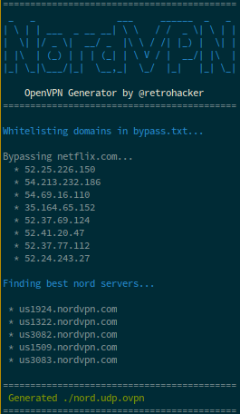

# Usage

```
$ git clone https://github.com/retrohacker/kickass_nord.git
$ cd kickass_nord
$ ./runme.sh
...
$ sudo openvpn nord.udp.ovpn
```

This script allows you to easily have specific domains bypass your VPN. Just place the domains you want to bypass your VPN into [`./bypass.txt`](./bypass.txt) and it will handle the rest!

This script generates 5 configuration files, one for each of the 5 best NordVPN servers recommended for you at the current time.

# Example output


